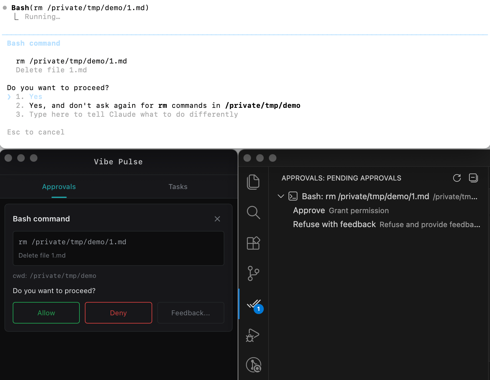

# Vibe Pulse

**Your Command Center for Claude Code**

> One place to approve all operations. One dashboard to track every task.

## See It in Action

### Unified Approval Center

All Claude Code permission requests flow through a single, elegant interface. Approve, deny, or provide feedback - all with one click.

### Real-Time Task Visualization

Watch your AI tasks unfold in real-time. See what's running, what's completed, and dive into the details when you need them.

### VSCode Integration

Approve operations directly from VSCode with [AgentPass](https://marketplace.visualstudio.com/items?itemName=hamsterbase.agent-pass) - no need to switch windows.

## Pricing

**Free Trial**
- Full access to all features
- 10 approvals per session (resets when you restart the app)
- Perfect for evaluation

**$10 One-Time Purchase**
- Unlimited approvals
- Pay once, own forever
- No subscriptions, no recurring fees

**Why choose Vibe Pulse?**
- **No Login Required** - Download, install, use. That's it.
- **100% Offline** - Runs entirely on your machine. Zero data collection.

## System Requirements

- macOS 12.0 or later

## Privacy Policy

**We collect nothing.**

Vibe Pulse runs completely offline on your local machine. We have no servers, no analytics, no telemetry. Your data never leaves your computer.

- No personal information collected
- No usage data transmitted
- No third-party tracking
- All data stored locally on your device

## FAQ

### Is Vibe Pulse open source?

No. Vibe Pulse is not open source. This GitHub repository is only used for collecting issues and user feedback.

## Download

**[Download Latest Release](https://github.com/hamsterbase/vibe-pulse/releases/latest)**

## Feedback & Issues

Found a bug or have a feature request? [Open an issue on GitHub](https://github.com/hamsterbase/vibe-pulse/issues)
